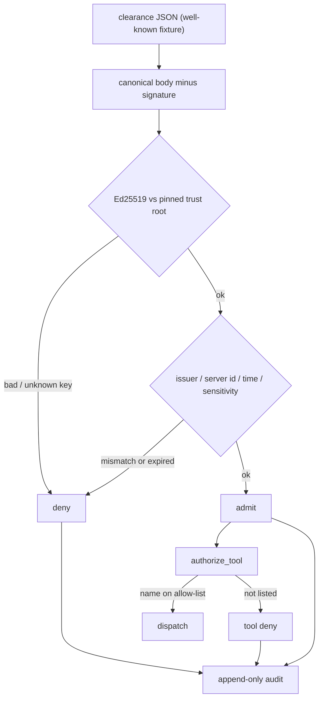

# MCP ATSA admission

I built this because an MCP host today takes a tool server’s identity and its `tools/list` on faith. TLS answers “did I reach the named endpoint.” OAuth answers “may this user use this server.” Nobody asks the third question: *is this server one the host is authorized to use as a tool provider, and which tools?*

A prompt-injected model can drive a destructive tool on any server the host already connected to. That is a door problem, not a “the model said a weird tool name” problem.

This repo is a **CPU-only Python gate** you run at connect time. No GPU. No real TPM. No Keycloak. It is inspired by draft **SEP-2809 / ATSA** (Attested Tool-Server Admission). It is **not** a full SEP port and it is **not** a copy of enclawed.

It answers one question: *may this host treat this server as a tool provider?* A second, separate check answers *may this admitted server run this tool?*

Official MCP today = OAuth. ATSA = draft SEP. [ACLE-MCP](https://arxiv.org/abs/2609.02690) = research paper, cited here, not implemented.

## Docs / LinkedIn surfaces

- [`docs/LINKEDIN.md`](docs/LINKEDIN.md) — post + carousel copy
- [`docs/LINKEDIN-NOTES.md`](docs/LINKEDIN-NOTES.md) — original engineer-style notes
- [`docs/one-pager.html`](docs/one-pager.html) — compact dark HTML for one LinkedIn screenshot

A public `mcp-atsa-admission-deck` may be added later by the coordinator. Until then the HTML lives in this private repo.

## Problem

- **TLS** proves you reached the name on the certificate. It does not prove the host is allowed to use that process as a tool provider.
- **OAuth** proves a user (or client) may call the server. It does not bind which tools this host may dispatch.
- **`tools/list`** is whatever the server claims. The host has no signed clearance and no closed allow-list.

ATSA’s idea — a small, offline-signed *clearance* at a well-known URI, verified against a pinned trust root *before any tool dispatch* — is the missing door check. Admitting the server is kept distinct from authorizing its tools.

## Related: ACLE

[ACLE-MCP](https://arxiv.org/abs/2609.02690) sits in the same neighborhood and is stricter about *when* the check runs. ATSA (this sample) is a **connect-time door check**: verify the server once before tools are in play. ACLE is a **per-call sticky note**: after OAuth, re-check the real provider-side workload and the exact action right before a risky invocation. Different timing, same instinct — don’t let a badge from earlier stand in for the thing happening now.

This repo does **not** implement ACLE leases, Keycloak, or a vTPM. The paper is cited so the two ideas stay distinct in writeups.

## Repo layout

```
src/mcp_atsa_admission/    package (cryptography for Ed25519)
tests/                     pytest
examples/demo.py           admit vs forged vs tool-deny walkthrough
fixtures/                  signed clearances + trust root + allow-list
scripts/sign_fixtures.py   regenerate fixtures from sample keys
docs/LINKEDIN.md           LinkedIn post + carousel
docs/LINKEDIN-NOTES.md     original presentation notes
docs/one-pager.html        flashy HTML one-pager
```

## Under the Hood



```python
from mcp_atsa_admission import admit_server, authorize_tool

result = admit_server(clearance, trust_root, policy)
if not result.admitted:
    raise SystemExit(result.to_dict())
if not authorize_tool(result.server_id, "get_forecast", allow_list):
    raise SystemExit("tool deny")
```

| Verdict | Meaning |
| --- | --- |
| `admit` | Signature, binding, and policy checks passed. Tools are still gated. |
| `deny` | Do not take `tools/list` from this server. Readable `reasons` say why. |

Admitting a server is **not** a blanket tool grant. `authorize_tool(server_id, tool_name, allow_list) -> bool` is a closed list: unknown server or unknown name is deny.

## Quickstart

Python 3.10+. Pin `cryptography` for Ed25519 and `pytest` for the suite. No network.

```bash
python -m pip install -r requirements.txt
python -m pip install -e .
python -m pytest
PYTHONPATH=src python examples/demo.py
python -m mcp_atsa_admission fixtures/clearance_valid.json
python -m mcp_atsa_admission fixtures/clearance_forged.json
python -m mcp_atsa_admission tool weather.internal get_forecast
python -m mcp_atsa_admission tool weather.internal delete_account
```

Regenerate signed fixtures (sample keys only):

```bash
PYTHONPATH=src python scripts/sign_fixtures.py
```

No env vars required. See `.env.example`.

## Sample logs

Valid clearance, matching trust root:

```text
{
  "verdict": "admit",
  "reasons": [
    {
      "code": "clearance_ok",
      "message": "Clearance 'clr-weather-2026' for server 'weather.internal' verified against pinned trust root 'corp-trust-root'."
    }
  ],
  "server_id": "weather.internal",
  "clearance_id": "clr-weather-2026",
  "clearance_hash": "sha256:…"
}
```

Forged signature:

```text
{
  "verdict": "deny",
  "reasons": [
    {
      "code": "bad_signature",
      "message": "Clearance signature did not verify under the pinned trust-root key 'corp-trust-root-ed25519-1'.",
      "field": "signature"
    }
  ],
  "server_id": "weather.internal"
}
```

Admitted server, tool not on the allow-list:

```text
{
  "verdict": "deny",
  "allowed": false,
  "server_id": "weather.internal",
  "tool_name": "delete_account",
  "reasons": [
    {
      "code": "tool_not_allowlisted",
      "message": "Tool 'delete_account' is not on the allow-list for 'weather.internal'. Refusing dispatch."
    }
  ]
}
```

CLI exit codes: `0` admit / tool allow, `2` deny, `1` I/O or usage.

## Lessons Learned

1. **Admission and authorization are different verbs.** I kept wanting to stuff the tool list into the clearance. That collapses the SEP’s whole point: the host admits a *server*, then a closed list admits a *tool*. A weather server that later grows `delete_account` should fail the second check even if the first still passes.

2. **Pin the trust root; don’t fetch it from the server.** If the clearance and the verification key both come from the thing you’re admitting, you have a selfie, not a door check. The fixtures keep the public key on the host side.

3. **Canonicalize once.** The same sorted-key JSON bytes are what we sign, what we verify, and what the audit chain hashes. If those three paths drift, you get “it verified on my laptop” bugs.

4. **ACLE is the next clock tick, not a competing brand.** Once I had the door check, the paper’s question was obvious: what if the workload changes *after* connect? That’s a sticky note on the call, not another clearance at the well-known URI. Citing both keeps the LinkedIn story honest.

## Out of scope

- Full SEP-2809 wire format / enclawed conformance vectors
- ACLE leases, Keycloak/OIDC, or vTPM quote verification
- Live MCP transports or a real well-known HTTP fetch (fixtures stand in)
- Caller-identity / purpose-scoped governance (the demand-side counterpart)

## Sources

- Draft SEP-2809: [Attested Tool-Server Admission](https://github.com/modelcontextprotocol/modelcontextprotocol/pull/2809)
- ACLE-MCP: [arXiv:2609.02690](https://arxiv.org/abs/2609.02690)
