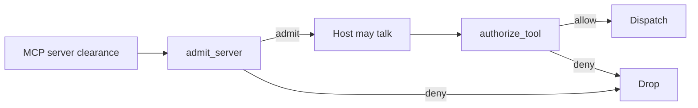

# LinkedIn / presentation notes (original sketch)

Earlier engineer-style one-pager notes. Prefer `LINKEDIN.md` for post copy and `one-pager.html` for the flashy linkable page.

# Check the MCP tool server at the door.

**TLS reached the name. OAuth issued a badge. ATSA asks whether this host is allowed to treat that server as a tool provider — before any dispatch.**

---

## The problem (3 bullets)

- A host today takes server identity + `tools/list` on faith.
- TLS = reached the named endpoint. OAuth = the user may use this server. Missing: is this server one the *host* is authorized to use as a tool provider, and which tools?
- A prompt-injected model can drive a destructive tool on any already-connected server.

---

## What we built (3 bullets)

- A **CPU-only** Python admission gate inspired by draft SEP-2809 (ATSA). No TPM. No Keycloak. No GPU.
- `admit_server(clearance, trust_root, policy) -> admit|deny` with readable reasons, plus a closed per-server tool allow-list.
- Append-only, hash-chained audit of connect-time and tool-time decisions.

---

## What we cite but did not implement

**ACLE-MCP** (arXiv:2609.02690) is a *per-call sticky note*: after OAuth, re-check the real server and the exact action at invocation time. Same neighborhood as ATSA, stricter timing. Official MCP today is still OAuth. ATSA is a draft SEP. ACLE is a research paper.

---

## Before / after

```
BEFORE                              AFTER
------                              -----
connect --> tools/list --> dispatch connect --> [ATSA door] --admit--> tools/list
        (identity on faith)                      |--deny--> stop
                                                 +--> [allow-list] --deny--> stop
```



---

## Fake screenshots

```
$ python -m mcp_atsa_admission fixtures/clearance_valid.json
{
  "verdict": "admit",
  "server_id": "weather.internal",
  "clearance_id": "clr-weather-2026",
  "reasons": [{ "code": "clearance_ok" }]
}
```

```
$ python -m mcp_atsa_admission fixtures/clearance_forged.json
{
  "verdict": "deny",
  "server_id": "weather.internal",
  "reasons": [
    {
      "code": "bad_signature",
      "message": "Clearance signature did not verify under the pinned trust-root key."
    }
  ]
}
```

```
$ python -m mcp_atsa_admission tool weather.internal delete_account
{
  "verdict": "deny",
  "allowed": false,
  "reasons": [{ "code": "tool_not_allowlisted" }]
}
```

---

## Try it

Repo: `https://github.com/sheshisheri-hi/mcp-atsa-admission` (private)

```
PYTHONPATH=src python examples/demo.py
python -m mcp_atsa_admission fixtures/clearance_forged.json
python -m mcp_atsa_admission tool weather.internal delete_account
```

Inspired by draft [SEP-2809](https://github.com/modelcontextprotocol/modelcontextprotocol/pull/2809). Related research: [ACLE-MCP](https://arxiv.org/abs/2609.02690).
